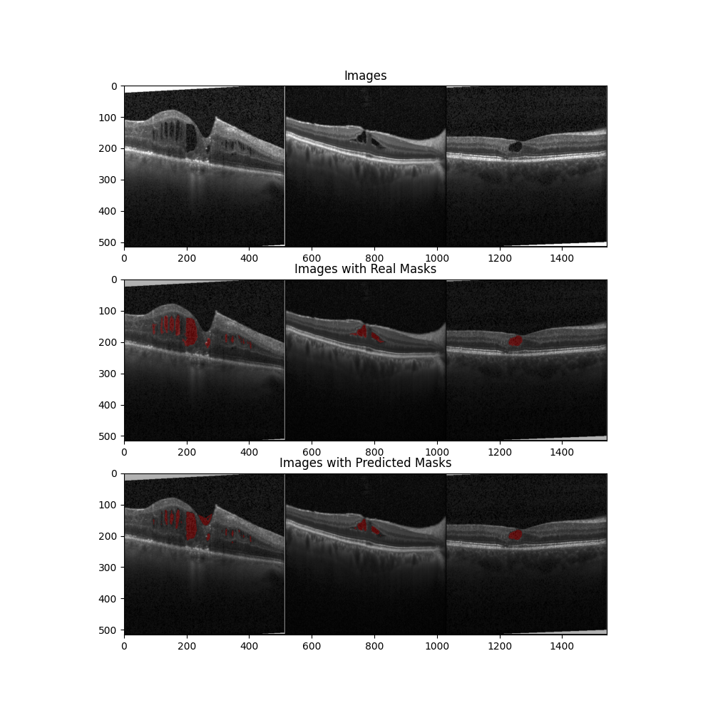

# Intraretinal Cystoid Fluid Detection - UNet

Implementation of a UNet to detect intraretinal cystoid fluid. 
All credit to the original dataset goes to: https://www.kaggle.com/datasets/zeeshanahmed13/intraretinal-cystoid-fluid

Modified dataset to fit this pipeline: https://drive.google.com/file/d/1E2nrNY4oAc7-qTpHgQwt4pxJpYUXDQ2z/view?usp=sharing
Extract this as 'retinal_dataset' in the main directory with all the python code files.

To use a pre-trained model, download it from here:https://drive.google.com/file/d/11cRv0FPIyRrrpN3A9zY7MyFenhXNREiv/view?usp=sharing
Extract it and put it under the 'saved_models' folder.

Please check config.py and see if any changes need to be made (none by default, unless you would like to confirm if the dataset and model path is okay).

## Result

## Acknowledgements

 - [Intraretinal Cystoid Fluid Dataset](https://www.kaggle.com/datasets/zeeshanahmed13/intraretinal-cystoid-fluid)
 - [UNet Intuition and Implementation](https://www.youtube.com/watch?v=IHq1t7NxS8k)

## License

[Attribution-NonCommercial-ShareAlike 4.0 International (CC BY-NC-SA 4.0)](https://creativecommons.org/licenses/by-nc-sa/4.0/)

